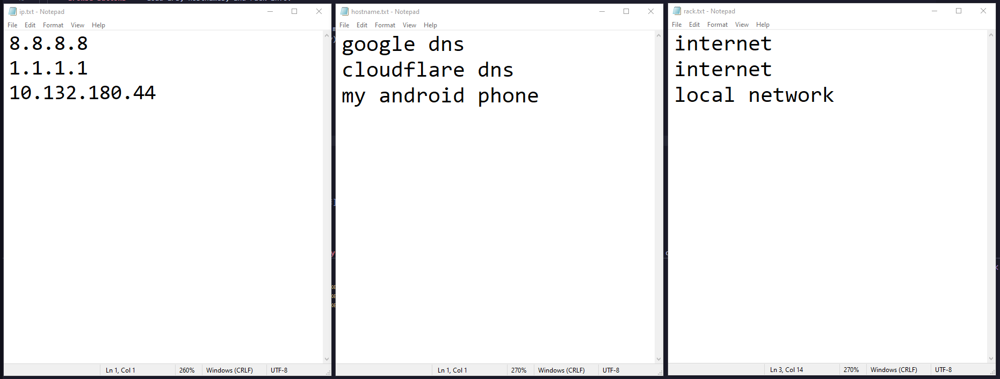
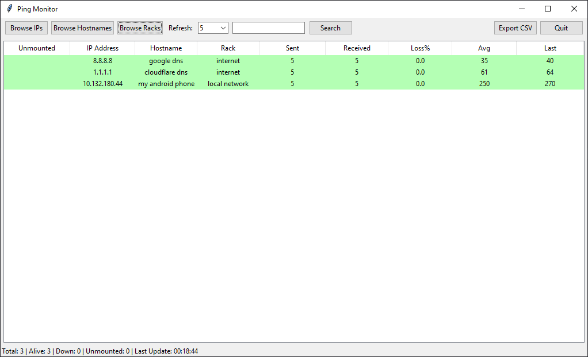
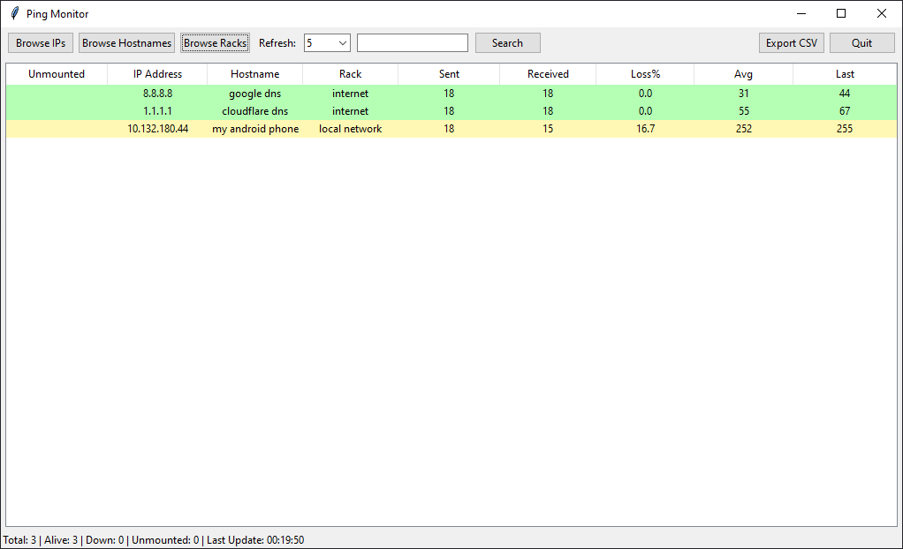
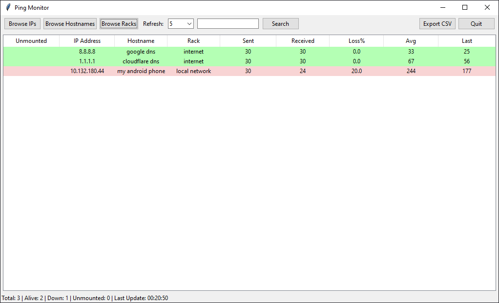
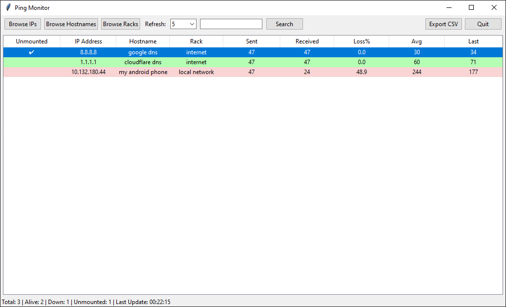

# 🖥️ Ping Dashboard

## 📌 Description
Ping Dashboard is a lightweight Python-based tool to **monitor the availability of multiple IP addresses in real-time**.  
It uses a **Tkinter GUI** to display IP addresses, hostname, rack information, and live ping statistics.  
Color-coded rows help quickly identify:
- 🟢 Alive (reachable)
- 🟡 Partial (recent ping failed but not yet fully down)
- 🔴 Down (3 consecutive ping failures)
- 🔵 Unmounted (manually marked using double cliking unmounted cell or using spacebar)

---

## ⚙️ Installation Instructions

### 🔑 Dependencies
Make sure you have the following installed (in this order):
1. [Python 3.9+](https://www.python.org/downloads/)
2. Tkinter (comes pre-installed with Python on most systems)
3. `concurrent.futures` (built-in with Python 3.2+)
4. Windows OS with `ping` command available

### 🚀 Setup
```bash
# Clone the repository
git clone https://github.com/harshvermac5/ping-dashboard.git
cd ping-monitor-app
````

---

## 🖱️ Usage Instructions

1. Prepare three text files (provided):

   * `ips.txt` → list of IP addresses (one per line)
   * `hostnames.txt` → matching hostnames (optional)
   * `racks.txt` → rack numbers (optional)
     *(Line numbers should correspond to the same device across files)*

2. Run the app:

```bash
python ping_monitor.py
```

3. Features:

   * **Browse Buttons** → Load IPs, hostnames, and rack info.
   * **Refresh Interval** → Choose auto-refresh frequency.
   * **Search** → Filter rows by IP/hostname/rack.
   * **Double-click Unmounted** → Mark/unmark devices as excluded from monitoring.
   * **Sorting** → Click column headers to sort (IPs sorted numerically).
   * **Cross-Platform** → Automatically adjust itself on all three major platforms (Windows, Linux and MacOS)
   * **Color codes**:

     * 🟢 Alive
     * 🟡 Partial
     * 🔴 Down (3 fails)
     * 🔵 Unmounted

4. Screenshots:

Sample files to paste IPs on (Provided):



After loading IPs:



When we miss responses:



When response are failing continuously (3 times):



Unmount tick-mark using double click or spacebar:



---

## 📜 License

This project is licensed under the **GPLv3 License** – see the [LICENSE](LICENSE) file for details.

---


⚠️ **Warning:** : This code is provided "as is", **without any warranty of any kind**, express or implied, including but not limited to the warranties of merchantability, fitness for a particular purpose, and non-infringement.

The author(s) shall **not be held liable for any damages** arising from the use of this tool.